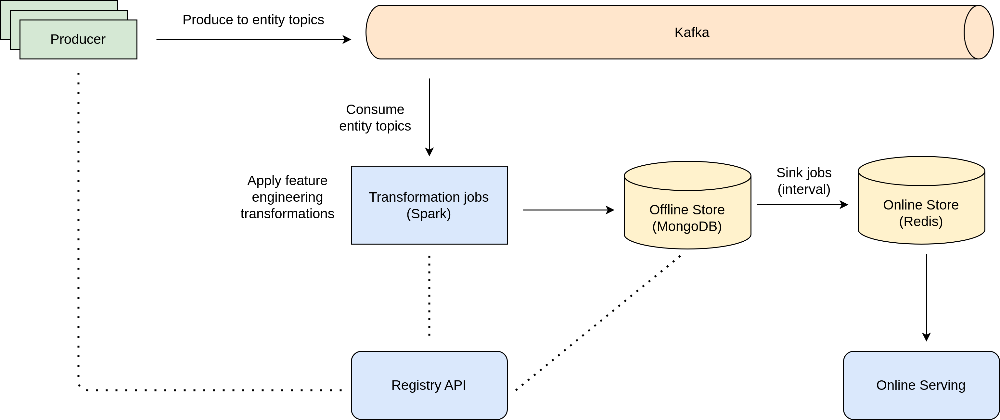
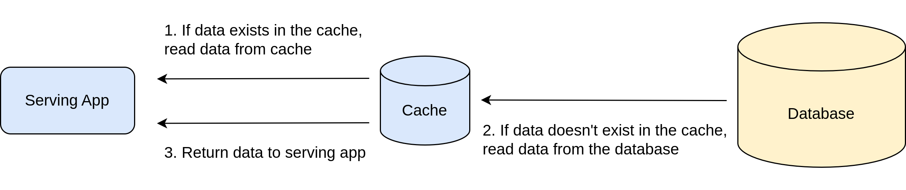

## Feature Store with Spark Streaming, Kafka, Redis, MongoDB

### 1. What is Feature Store?
Feature Store provides a centralized location to store and document features that will be used in machine learning models and can be shared across projects.

A Feature Store solution might address one or a combination of these problems:

- Feature management:
A feature store can help teams share and discover features, as well as manage roles and sharing settings for each feature (feature catalog).
- Feature computation:
A feature store can help with both performing feature computation and storing the results of this computation (data warehouse).
- Feature consistency:
A key selling point of modern feature stores is that they unify the logic for both batch features and streaming features, ensuring the consistency between features during training and features during inference.

### 2. Proposed Architecture

The solution currently implemented contains only the following components:

- Producer: applications producing entities to the kafka.
- Registry: repository of the schemas created on the pipeline stages.
- Kafka: streaming platform used to enable spark jobs to transform the entities produced by applications into features used by ML models. a high-performance data pipeline.
- Transformations: spark jobs to transform the entities produced by applications into features used by ML models. (User defined functions).
- Sinks: application that syncs the offline feature to the online store.
- Redis: in-memory data structure store, used as an online storage layer (caching).

### 3. Demo
[Link here!](demo/)